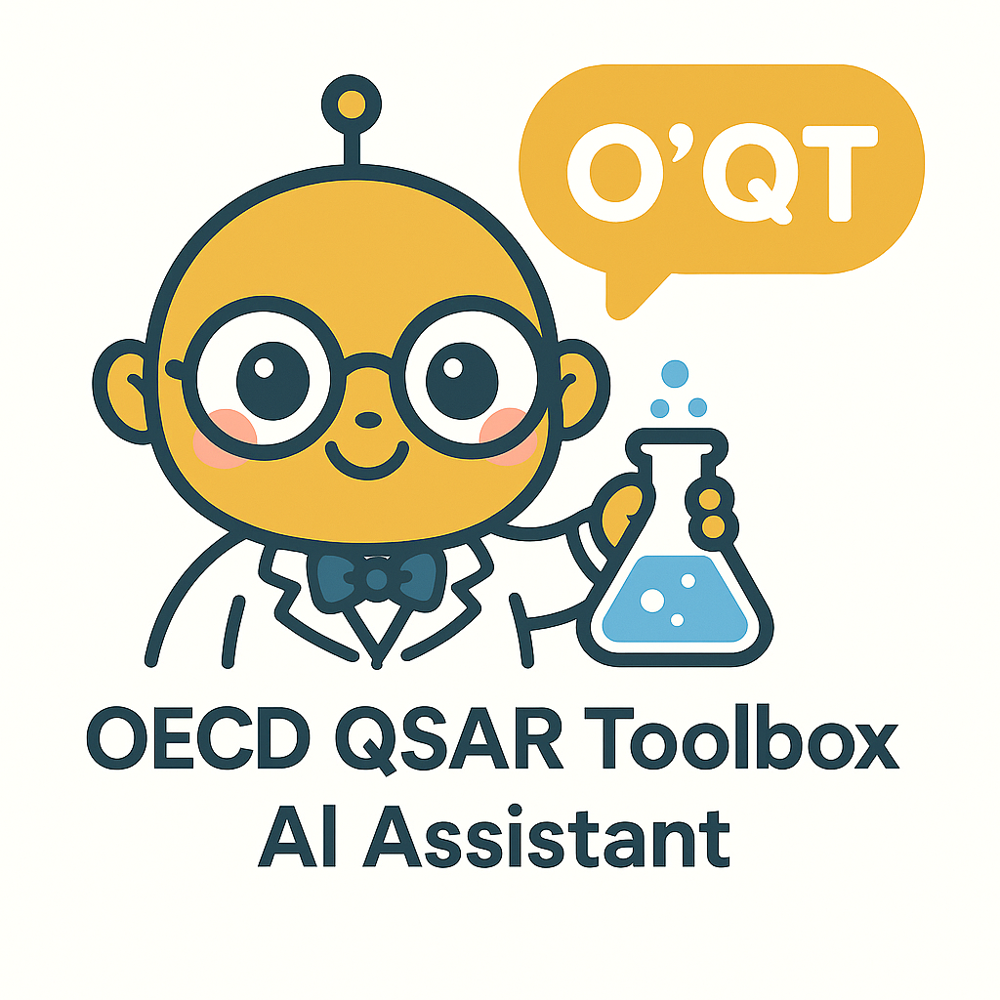

# 🧪 O'QT: The OECD QSAR Toolbox AI Assistant

**Analyze chemicals, assess hazards, and get Read-Across recommendations using a powerful multi-agent AI system connected to the OECD QSAR Toolbox.**

This application uses LangChain and OpenAI agents to interpret data fetched from the OECD QSAR Toolbox API, providing comprehensive chemical analysis reports.

## Features

* Chemical search by name or SMILES notation.
* Retrieval of physicochemical properties, experimental data, and chemical profiling information via the QSAR Toolbox API.
* Downloadable raw data (JSON, CSV) and synthesized AI reports.
* **Advanced AI Analysis:** A team of specialized AI agents analyzes the data:
    * **Chemical Context:** Confirms the chemical's identity.
    * **Physical Properties:** Analyzes physical characteristics.
    * **Environmental Fate:** Evaluates environmental behavior.
    * **Profiling/Reactivity:** Assesses reactivity and toxicological alerts.
    * **Experimental Data:** Interprets experimental results.
    * **Read-Across:** Suggests analogue chemicals and strategies.
    * **Synthesis:** Combines all analyses into a final report.

---

## ⚠️ CRITICAL REQUIREMENT: The OECD QSAR Toolbox API

**This application CANNOT function without the official OECD QSAR Toolbox software.**

* **What it is:** The OECD QSAR Toolbox is a separate, comprehensive software package developed by the OECD. It contains the necessary databases, calculation engines, and profiling tools used by this assistant.
* **How this app uses it:** This application acts as a **client**. It connects to the **Web API** of your locally running QSAR Toolbox instance to request data (like properties, experimental results, profiling) for a specific chemical. The AI agents in this application then process and interpret the data received *from* the Toolbox API.
* **Where to get it:** You must download and install it directly from the OECD: [OECD QSAR Toolbox Download Page](https://qsartoolbox.org/download/)
* **Operating System:** The OECD QSAR Toolbox software **runs only on Microsoft Windows**. Therefore, you need a Windows environment to run the Toolbox and its API.
* **License:** You must agree to the OECD QSAR Toolbox End User License Agreement (EULA) when you install it.

**Why can't this be simpler (e.g., using Docker)?**

The QSAR Toolbox EULA **strictly prohibits** redistribution, copying (except for backup), or modification of the software (see Articles 2.2.b, 2.2.c, 2.2.f of the EULA). This means:

1.  **No Bundling:** We cannot legally include the QSAR Toolbox software within this application's code or installer.
2.  **No Docker Image:** We cannot create or distribute a Docker image containing the QSAR Toolbox software, as this would involve unauthorized copying and redistribution.

Therefore, **manual installation and API activation by each user on a Windows machine is the only compliant way** to use this assistant application.

*(Optional: Consider adding the Docker workaround suggestion from the review here if desired)*
> **Docker Note:** While the Toolbox itself cannot be containerized, you could potentially run *this* assistant application in a Docker container. Users would still need the QSAR Toolbox running on a Windows host (or VM) and configure the container's `QSAR_TOOLBOX_API_URL` environment variable to point to that host's IP address and port.

---

## Installation and Usage Guide

Follow these steps carefully:

**Phase 1: Install and Configure the OECD QSAR Toolbox (on Windows)**

*(This only needs to be done once. This step is MANDATORY)*

1.  **Go to a Windows Machine:** You need access to a computer running Microsoft Windows.
2.  **Download:** Visit the [OECD QSAR Toolbox Download Page](https://qsartoolbox.org/download/) and download the latest version of the Toolbox.
3.  **Install:** Run the installer and follow the on-screen prompts. Make sure you accept the End User License Agreement (EULA).
4.  **Launch QSAR Toolbox:** Start the QSAR Toolbox application.
5.  **Enable the Web API:**
    * Inside the Toolbox, find the settings or options menu (often under "Tools", "Options", or similar).
    * Locate the "Web API" or "Web Services" settings.
    * **Check the box to enable the Web API.**
    * Note down the **Port number** it will use (the default is usually `5000`).
    * Ensure the API is set to be accessible. It usually defaults to `localhost` (`127.0.0.1`), which is fine if you run the Streamlit Assistant on the *same* Windows machine.
6.  **Keep Toolbox Running:** The QSAR Toolbox application must be running with the API enabled whenever you want to use this Streamlit Assistant.
7.  **(Optional) Find Windows IP Address:** If you plan to run the Streamlit Assistant on a *different* computer (e.g., your Mac or Linux machine) than the Windows PC running the Toolbox:
    * Open Command Prompt on the Windows PC (search for `cmd`).
    * Type `ipconfig` and press Enter.
    * Look for the "IPv4 Address" under your active network connection (e.g., Wi-Fi or Ethernet). It will look something like `192.168.1.105`. Note this down.
    * You may also need to configure the Windows Firewall on that PC to allow incoming connections on the port noted in step 5 (e.g., 5000).

**Phase 2: Install the QSAR Assistant (This Project)**

*(Can be done on Windows, macOS, or Linux)*

1.  **Prerequisites:** Ensure you have Python 3.8+ and `pip` installed.
2.  **Create Virtual Environment (Recommended):**
    ```bash
    python -m venv venv
    # Activate:
    # Windows: venv\Scripts\activate
    # macOS/Linux: source venv/bin/activate
    ```
3.  **Install from PyPI (Recommended for users):**
    ```bash
    pip install qsar-assistant
    ```
    *(Alternatively, for development, clone the repository and install in editable mode: `pip install -e .[dev]` from the project root directory)*
4.  **Configure Environment Variables:**
    * Create a file named `.env` in your working directory (or the project root if installed from source).
    * Add the following lines, replacing placeholders with your actual values:
        ```dotenv
        # Your OpenAI API Key for the AI agents
        OPENAI_API_KEY=sk-YourActualOpenAIKeyHere

        # *** THIS IS THE MOST IMPORTANT SETTING ***
        # Set the URL for YOUR running QSAR Toolbox API (from Phase 1)

        # Option 1: Running this Assistant on the SAME Windows PC as the Toolbox
        QSAR_TOOLBOX_API_URL=http://localhost:5000/api

        # Option 2: Running this Assistant on a DIFFERENT machine (Mac, Linux, another PC)
        # Use the Windows PC's IP address (from Phase 1, step 7) and the correct port (usually 5000)
        # Example: QSAR_TOOLBOX_API_URL=http://192.168.1.105:5000/api
        ```
        *Make sure the `QSAR_TOOLBOX_API_URL` points correctly to where your QSAR Toolbox API is running.*

**Phase 3: Run the QSAR Assistant**

1.  **Ensure Toolbox is Running:** Double-check that the OECD QSAR Toolbox is running on the Windows machine and its Web API is active (Phase 1, step 6).
2.  **Activate Environment:** If you created a virtual environment, make sure it's activated.
3.  **Run the App:** Open your terminal or command prompt and run:
    ```bash
    qsar-assistant
    ```
4.  **Access in Browser:** Open your web browser and go to the local URL provided (usually `http://localhost:8501`).
5.  **Check Connection:** The sidebar in the application should show "✅ Connected to QSAR Toolbox". If it shows an error, double-check the Toolbox is running, the API is enabled, and the `QSAR_TOOLBOX_API_URL` in your `.env` file is correct and reachable.

## How to Use the Assistant

1.  Use the sidebar to choose search type (Name or SMILES) and enter the identifier.
2.  Optionally, provide context for the AI analysis (e.g., "assess potential for liver toxicity").
3.  Click "Analyze Chemical" in the sidebar.
4.  Wait for the analysis (progress bar will update). Data is fetched from the QSAR Toolbox API, then processed by the AI agents.
5.  Explore the results in the tabs: Chemical Overview, Properties, Experimental Data, Profiling.
6.  View the final synthesized report generated by the AI.
7.  Download raw data, the synthesized report, or individual specialist analyses using the download buttons.

## Workflow Overview


The application follows a multi-stage process:

1.  **QSAR Toolbox API Setup:** (User action) Install and run the OECD QSAR Toolbox with its Web API enabled on a Windows machine.
2.  **User Input:** Provide a chemical identifier (Name/SMILES) and optional analysis context via the Streamlit interface.
3.  **Data Collection:** The application connects to the configured QSAR Toolbox API to retrieve chemical data (properties, experimental, profiling).
4.  **Chemical Context Establishment:** An AI agent confirms the precise chemical identity.
5.  **Parallel Specialist Analysis:** Multiple AI agents concurrently analyze specific data subsets (properties, environmental fate, profiling, experimental data).
6.  **Read-Across Analysis:** An AI agent analyzes data gaps and suggests a detailed read-across strategy and potential analogues.
7.  **Report Synthesis:** A final AI agent synthesizes all specialist outputs and the read-across analysis into a comprehensive report.
8.  **Output:** Display results, reports, and download options in the Streamlit UI.

---

## Project Structure

```
qsar-assistant/
├── .github/
│   └── workflows/
│       └── ci.yml         # GitHub Actions CI configuration
├── src/
│   └── qsar_assistant/    # Main package source code
│       ├── __init__.py
│       ├── app.py         # Main Streamlit application logic
│       ├── cli.py         # Command-line entry point script
│       ├── components/    # UI component modules
│       │   ├── __init__.py
│       │   ├── search.py
│       │   └── results.py
│       └── utils/         # Utility modules
│           ├── __init__.py
│           ├── data_formatter.py
│           ├── llm_utils.py
│           ├── prompts.yaml # Externalized LLM prompts
│           └── qsar_api.py  # QSAR Toolbox API client logic
├── tests/                 # Test suite
│   ├── __init__.py
│   ├── test_app.py
│   ├── test_api_behavior.py
│   ├── test_data_formatter.py
│   ├── test_integration.py
│   ├── test_llm_utils.py
│   └── test_qsar_api.py
├── .env.example           # Example environment variables
├── .gitignore             # Git ignore rules
├── CONTRIBUTING.md        # Contribution guidelines
├── LICENSE                # Project License (Apache 2.0)
├── pyproject.toml         # Build system & package configuration
└── README.md              # This file
```

## Contributing

We welcome contributions! Please see `CONTRIBUTING.md` for guidelines. Note that development and running tests involving direct API interaction requires the QSAR Toolbox setup described above.

## License

This project is licensed under the Apache License, Version 2.0. See the `LICENSE` file for details. The OECD QSAR Toolbox has its own separate license agreement that you must adhere to when installing and using it.
