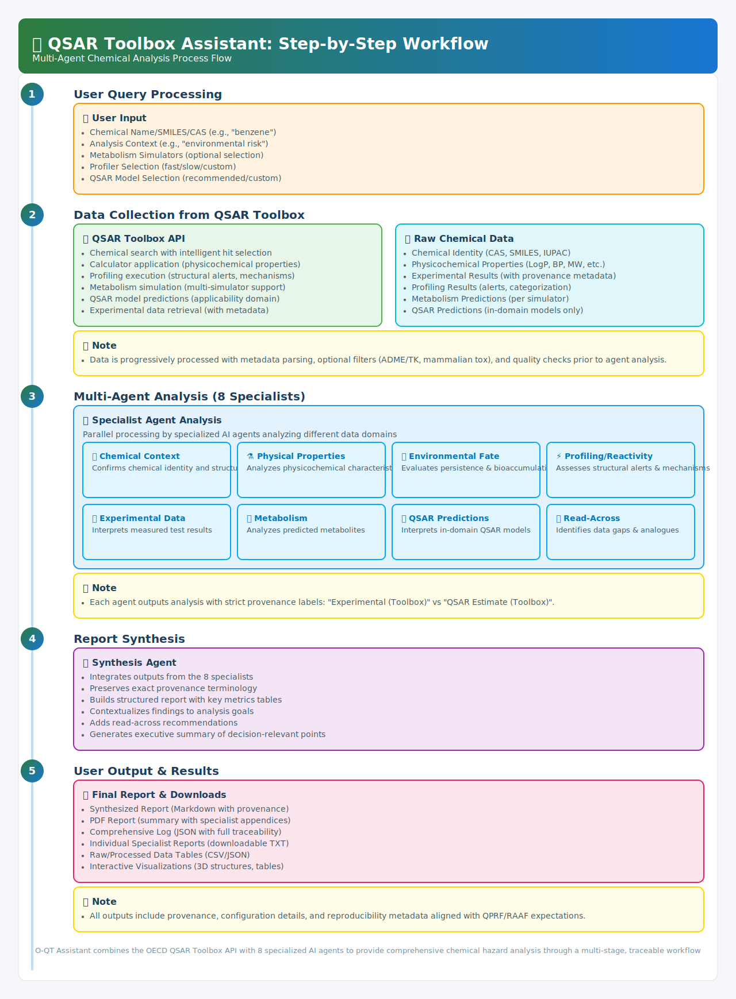

[](https://doi.org/10.5281/zenodo.17468969)


# 🧪 O-QT: The OECD QSAR Toolbox AI Assistant

O-QT is a multi-agent AI system that connects to your local OECD QSAR Toolbox installation. It automates the process of chemical analysis, hazard assessment, and read-across strategy development, producing comprehensive, auditable reports.

The application uses a team of specialized LangChain and OpenAI-powered agents to interpret data fetched from the OECD QSAR Toolbox WebAPI, providing a seamless workflow from chemical search to final report.



---

### ⚠️ Critical Requirement: The OECD QSAR Toolbox API

This assistant application CANNOT function without the official OECD QSAR Toolbox software running on a Windows machine.

* What it is: The OECD QSAR Toolbox is a separate, comprehensive software package developed by the OECD. It contains the necessary databases, calculation engines, and profiling tools that O-QT relies on.
* How this app uses it: O-QT acts as a client. It connects to the Web API of your locally running QSAR Toolbox instance to request data (like properties, experimental results, and profiling). The AI agents then process and interpret the data received from the Toolbox API.
* Where to get it: You must download and install it directly from the OECD: OECD QSAR Toolbox Download Page: https://qsartoolbox.org/downloads/
* Operating System: The OECD QSAR Toolbox software runs only on Microsoft Windows.
* License: You must agree to the OECD QSAR Toolbox End User License Agreement (EULA) when you install it.

#### Why can't the Toolbox be included in a Docker image?

The QSAR Toolbox EULA strictly prohibits redistribution, copying, or modification of the software. This means:
* No Bundling: We cannot legally include the QSAR Toolbox software within this application's code.
* No Docker Image: We cannot create or distribute a Docker image containing the QSAR Toolbox software, as this would be unauthorized redistribution.

Therefore, manual installation and API activation by each user on a Windows machine is the only compliant way to use this assistant.

---

### Features

* Chemical search by name, CAS, or SMILES with automatic hit ranking.
* Retrieval of physicochemical properties, experimental data, metabolism simulators, profiler alerts, and curated QSAR catalog metadata.
* QPRF/RAAF enrichment: IUCLID lookups, calculator provenance, database catalog metadata, and key-study annotations for experimental records.
* Interactive visualization: inline 2D depictions plus 3D molecular preview (py3Dmol) when SMILES are available.
* Downloadable raw data (JSON, CSV) alongside publication-ready PDF and text reports.
* Curated QSAR presets based on the O-QT Pro catalogue with heuristics to avoid ultra-slow models.
* Advanced AI Analysis: a team of specialist LangChain agents orchestrated to cover every aspect of hazard assessment:
    * Chemical Context – confirms identity and regulatory identifiers.
    * Physical Properties – interprets experimental and calculator values with provenance labels.
    * Environmental Fate – evaluates persistence, mobility, and bioaccumulation signals.
    * Profiling/Reactivity – summarizes structural alerts and mechanistic flags.
    * Experimental Data – ranks key studies, parses metadata, and highlights evidence gaps.
    * Metabolism – analyses simulator outputs and metabolite coverage.
    * QSAR Predictions – filters for in-domain models, summarising runtime and donors.
    * Read-Across – produces evidence vs. gap matrices and analogue suggestions tailored to scope.
    * Synthesis – produces a structured, publication-grade report referencing all provenance tags.

---

### What's New in v1.0.0

* Complete alignment with the closed-source O-QT Pro workflow (QPRF metadata, curated QSAR presets, IUCLID enrichment, 3D preview).
* Redesigned prompt pack enforcing structured “assertions” blocks for every specialist agent.
* Publication-ready PDF generator with key study coverage badge, provenance tables, and logo support.
* Streamlined tests using lightweight LangChain shims so the suite runs without live OpenAI calls.
* Reproducible dependency lock via Poetry (`poetry.lock`) and Python ≥3.10 support.

---

### Installation and Usage Guide

#### Method 1: Docker (Recommended)

This is the easiest and most reliable way to run the O-QT Assistant. It isolates the application's dependencies but still requires a connection to your separate QSAR Toolbox installation.

Step 1: Prerequisites
* Ensure Docker is installed and running on your machine (Windows, macOS, or Linux).
* Complete the setup for the OECD QSAR Toolbox on a Windows machine, ensuring its WebAPI is enabled and running. Note the IP address of this machine.

Step 2: Clone the Repository
```bash
git clone https://github.com/your-org/oqt-assistant.git
cd oqt-assistant
```

Step 3: Configure Environment Variables
Create a `.env` file by copying the provided example.

```bash
cp .env.example .env
```

Edit the `.env` file and fill in your details:

```env
# URL of your running QSAR Toolbox API.
# Replace <IP_ADDRESS_OF_WINDOWS_PC> with the actual IP address.
QSAR_TOOLBOX_API_URL="http://<IP_ADDRESS_OF_WINDOWS_PC>:5001/api/v6.0"

# Provide ONE of the following API keys
OPENAI_API_KEY="sk-..."
# OPENROUTER_API_KEY="..."

# Optional: Set to "1" to redact the API URL in generated PDFs
# OQT_REDACT_PDF_URLS=1
```

> Networking Tip: If you are running Docker on the same Windows machine as the Toolbox, you may need to use `host.docker.internal` instead of an IP address. For example: `QSAR_TOOLBOX_API_URL="http://host.docker.internal:5001/api/v6.0"`

Step 4: Build and Run the Docker Container

```bash
# Build the Docker image
docker build -t oqt-assistant .

# Run the container, passing the .env file for configuration
docker run --rm -p 8501:8501 --env-file .env oqt-assistant
```

Step 5: Access the Assistant
Open your web browser and navigate to http://localhost:8501. Check the sidebar to confirm a successful connection to your QSAR Toolbox.

-----

#### Method 2: Local Python (For Development)

This method is for contributors or users who want to run the application directly from the source code.

Step 1: Prerequisites

* Python 3.10+ and `pip` installed.
* Complete the setup for the OECD QSAR Toolbox on a Windows machine, as described above.

Step 2: Create a Virtual Environment

```bash
python -m venv .venv
# On Windows:
.venv\Scripts\activate
# On macOS/Linux:
source .venv/bin/activate
```

Step 3: Install Dependencies
From the root of the cloned repository, install the project in editable mode with development dependencies:

```bash
pip install -e .[dev]
```

Step 4: Configure Environment Variables
Create and edit the `.env` file as described in Step 3 of the Docker instructions, ensuring `QSAR_TOOLBOX_API_URL` points to your running Toolbox instance.

Step 5: Run the Application
Launch the Streamlit app using the installed command-line script:

```bash
oqt-assistant
```

Then, access the application in your browser at http://localhost:8501.

-----

### Testing

We recommend using Poetry for local development. After installing dependencies:

```bash
poetry run pytest
```

This exercises the full suite, including Streamlit stubs and LangChain agent orchestration.

### Command-line Usage

In addition to the Streamlit UI, you can run headless analyses via the CLI once the package is installed (locally or inside the Docker container):

```bash
oqt-assistant analyze "Acetone" \
  --search-type name \
  --context "General hazard assessment" \
  --api-url http://13.50.204.132:8804/api/v6 \
  --output-dir cli_runs/acetone
```

Key options:

- `--simulator GUID` / `--simulator-all` to execute metabolism simulators.
- `--profiler GUID` / `--profiler-all` to include profiling suites.
- `--qsar-mode {recommended,all,none}` or `--qsar-guid GUID` to fine-tune the QSAR models executed.
- Override the LLM provider/model with `--provider`, `--model-name`, `--temperature`, etc., or rely on environment variables (`OPENAI_API_KEY`, `QSAR_TOOLBOX_API_URL`).

Outputs (JSON log, Markdown report, and PDF) are written to the directory passed via `--output-dir`.

### Citation

If you use the O-QT Assistant in academic or regulatory work, please cite the Zenodo record and manuscript under review:

> I. Djidrovski, *O-QT Assistant: A Multi-Agent AI System for Streamlined Chemical Hazard Assessment and Read-Across Analysis using the OECD QSAR Toolbox API*, Zenodo (2025). DOI: [10.5281/zenodo.17468969](https://doi.org/10.5281/zenodo.17468969)

The Zenodo archive mirrors the v1.0.0 GitHub release and includes all figures accompanying the paper.

### How to Use the Assistant

1. Check Connection: Use the "Check Connection" button in the sidebar to ensure O-QT can communicate with your QSAR Toolbox API.
2. Enter Input: In the main area, select a search type (Name or SMILES), enter the chemical identifier, and provide any analysis context.
3. Configure Scope: Select the desired metabolism simulators, profilers, and QSAR models you wish to run.
4. Analyze: Click the "🚀 Analyze Chemical" button to start the workflow. A progress bar will show the current status.
5. Review Results: Explore the generated data in the tabs for properties, experimental data, profiling, etc.
6. Download: Use the download buttons in the sidebar to save the comprehensive PDF report, the full JSON log, or individual agent analyses as TXT files.

### Project Structure

```
oqt-assistant/
├─ docs/                  # Release notes, feature matrix, etc.
├─ examples/              # Sanitised example bundles (PDF + JSON)
├─ src/oqt_assistant/     # Main Streamlit application source code
├─ tests/                 # Test suite for the application
├─ .env.example           # Example environment variables file
├─ CONTRIBUTING.md        # Guidelines for contributors
├─ Dockerfile             # Container definition for the UI
├─ LICENSE                # Apache 2.0 License
├─ pyproject.toml         # Build system and package configuration
└─ README.md              # This file
```

---

### Citation

The scientific methodology, validation, and application of the O-QT Assistant are detailed in a manuscript currently under peer review.

Title: O’QT Assistant: A Multi-Agent AI System for Streamlined Chemical Hazard Assessment and Read-Across Analysis using the OECD QSAR Toolbox API

If you use this software in your research, we kindly ask that you check back for the full citation upon publication. For now, you can cite the repository directly.

---

### Contributing

We welcome contributions! Please see `CONTRIBUTING.md` for guidelines on coding standards, the pull request process, and testing.

### License

This project is licensed under the Apache License, Version 2.0. See the `LICENSE` file for details. The OECD QSAR Toolbox has its own separate license agreement that you must adhere to when installing and using it.

### Maintainer

© 2025 Ivo Djidrovski — Utrecht University
Contact: i.djidrovski@uu.nl
